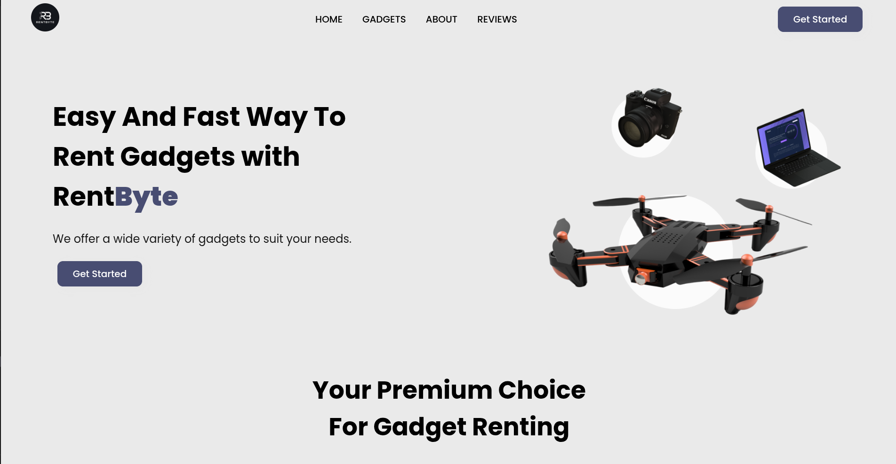
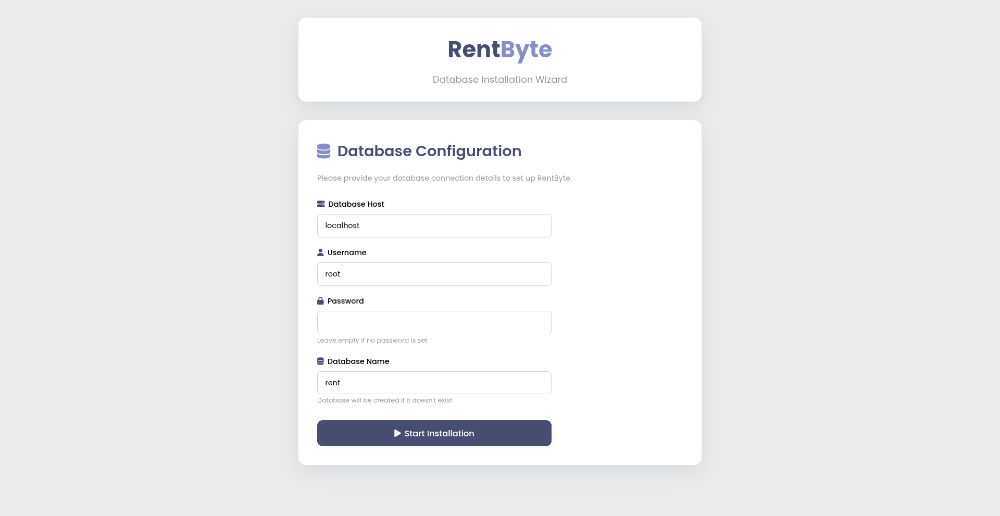
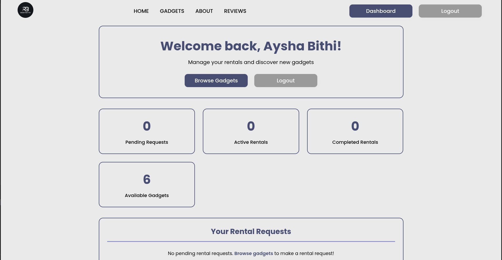
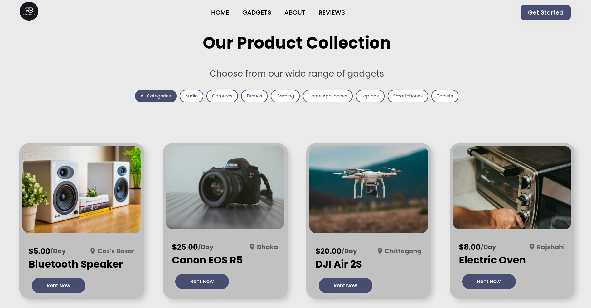
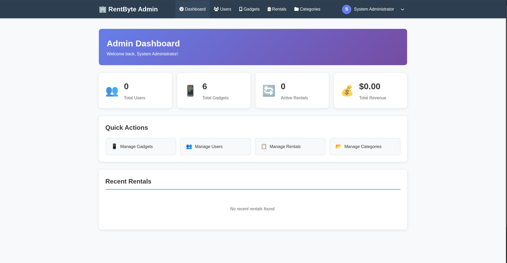

# RentByte - Gadget Rental System

A web-based gadget rental management system built with PHP and MySQL. RentByte allows users to browse and rent various gadgets while providing administrators with powerful tools to manage inventory, users, and rentals.

## Quick Start

1. **Clone Repository**: `git clone https://github.com/AyshaBithi/RentByte-Website.git`
2. **Setup Database**: Navigate to `http://localhost/RentByte-Website/install.php` to set up the database
3. **Admin Login**: Username: `admin@mail.com`, Password: `password`
4. **User Access**: Create a new account or browse gadgets as a guest

## Screenshots

### Frontend Interface

*Clean and modern homepage with hero section and gadget showcase*

### Installation Process

*Simple database installation process*

### User Dashboard

*User-friendly dashboard for managing rentals*

### Gadgets Catalog

*Browse through available gadgets*

### Admin Dashboard

*Admin panel with statistics and management tools*

## Features

### User Features
- **Secure Authentication**: User registration and login system
- **Browse Gadgets**: View available gadgets by category with detailed information
- **Smart Booking**: Date-based rental system with availability checking
- **Automatic Pricing**: Dynamic pricing calculation based on rental duration
- **User Dashboard**: Manage active rentals and view rental history
- **Responsive Design**: Works seamlessly on all devices

### Admin Features
- **Admin Dashboard**: Comprehensive overview with statistics and analytics
- **User Management**: Complete user account management and moderation
- **Gadget Management**: Full CRUD operations for inventory management
- **Rental Management**: Track and update rental statuses in real-time
- **Category Management**: Organize gadgets into customizable categories
- **Status Updates**: Real-time rental status tracking and notifications

## Technology Stack

- **Backend**: PHP 7.4+ with MySQLi
- **Database**: MySQL 5.7+ with normalized schema
- **Frontend**: HTML5, CSS3, Vanilla JavaScript
- **UI**: Font Awesome 6.5.2 icons
- **Security**: Password hashing, CSRF protection, input sanitization

## Installation

### Prerequisites
- XAMPP, WAMP, LAMP, or similar server environment
- PHP 7.4 or higher
- MySQL 5.7 or higher
- Modern web browser

### Setup Steps

1. **Download Project**
   ```bash
   # Clone from GitHub
   git clone https://github.com/AyshaBithi/RentByte-Website.git

   # Or download and place in your web server directory
   /opt/lampp/htdocs/RentByte-Website/     # Linux/Mac
   C:\xampp\htdocs\RentByte-Website\      # Windows
   ```

2. **Database Installation**
   - Start your MySQL server
   - Visit: `http://localhost/RentByte-Website/install.php`
   - Follow the automated installation process

3. **Access the System**
   - **Website**: `http://localhost/RentByte-Website/`
   - **Admin Panel**: `http://localhost/RentByte-Website/admin/dashboard.php`

### Default Credentials
- **Admin**: Username: `admin@mail.com`, Password: `password`

## Project Structure

```
RentByte-Website/
├── admin/                 # Admin panel
│   ├── dashboard.php         # Admin dashboard
│   ├── users.php            # User management
│   ├── gadgets.php          # Gadget management
│   ├── rentals.php          # Rental management
│   └── categories.php       # Category management
├── assets/               # Static assets
│   ├── css/                 # Stylesheets
│   ├── img/                 # Images
│   └── js/                  # JavaScript
├── database/             # Database files
│   └── schema.sql           # Database schema
├── includes/             # PHP includes
│   ├── config.php           # Configuration
│   ├── header.php           # Main header
│   ├── footer.php           # Main footer
│   ├── admin_header.php     # Admin header
│   └── admin_footer.php     # Admin footer
├── index.php             # Homepage
├── login.php             # User login
├── signup.php            # User registration
├── dashboard.php         # User dashboard
├── product.php           # Gadget catalog
├── gadget-details.php    # Gadget details
├── logout.php            # Logout handler
└── install.php           # Database installer
```

## Usage Guide

### For Users
1. **Sign Up**: Create your account with email verification
2. **Browse**: Explore gadgets by category or search
3. **Rent**: Select dates, choose delivery options, and book
4. **Manage**: Track rentals through your personal dashboard

### For Administrators
1. **Dashboard**: Monitor system statistics and recent activity
2. **Inventory**: Add, edit, or remove gadgets from the catalog
3. **Users**: Manage user accounts and permissions
4. **Rentals**: Process bookings and update rental statuses
5. **Categories**: Organize gadgets into logical categories

## Security Features

- **Password Security**: BCrypt hashing with salt
- **CSRF Protection**: Token-based request validation
- **Input Sanitization**: XSS and SQL injection prevention
- **Session Security**: Secure session management
- **Role-based Access**: User and admin permission levels
- **Data Validation**: Server-side input validation

## Key Features

### Smart Rental System
- **Conflict Prevention**: Automatic availability checking
- **Dynamic Pricing**: Real-time cost calculation
- **Flexible Delivery**: Pickup, standard, or express options
- **Status Tracking**: Complete rental lifecycle management

### Database Design
- **Normalized Schema**: Efficient relational database structure
- **Data Integrity**: Foreign key constraints and validation
- **Audit Trail**: Complete rental history tracking
- **Scalable Architecture**: Designed for growth and expansion

## Contributing

1. Fork the repository
2. Create a feature branch
3. Make your changes
4. Test thoroughly
5. Submit a pull request

## License

This project is licensed under the MIT License - see the LICENSE file for details.

## Support

For support and questions:
- Check the troubleshooting section
- Review the documentation
- Contact the development team

## Changelog

### Version 1.0.0
- Initial release with core rental functionality
- User and admin management systems
- Complete CRUD operations for all entities
- Responsive design implementation
- Security features implementation
